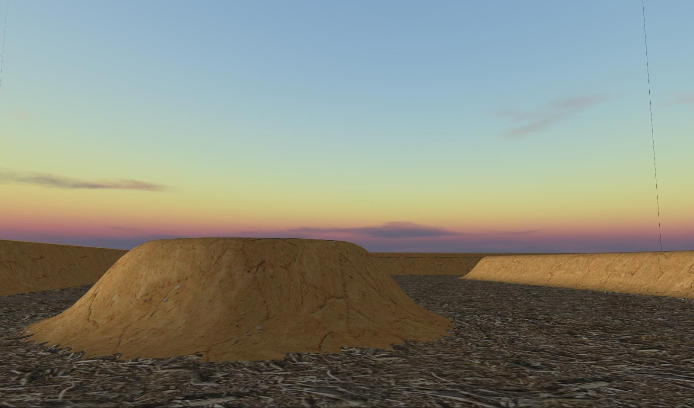

> This post is outdated and only exists for historical reasons

In the first two years of Murdoch University during my bachelor of Science (Computer Science and Games Technology)
I was taught many things including C, C++, C#, java, Assembly, Applied Mathematics, Systems Analyses,
Databases (SQL), OpenGL and Computer Graphics Applications as such as Autodesk 3DS Max in modeling,
texturing and rendering.

My first two semester were comprised of an introduction unit, in which we were taught how to write documents
at a university standard. I also took several Programming units, in the first semesters units we were taught
non object orientated programming, including C. C is a brilliant first language for all want to be programmers,
it is very fast and powerful AND also will blow up in your face if you do anything wrong!
Learning through pain is a great way to learn, if you don't design the system with a proper mind state it won't work.
This is vital because in more new age languages, as such as Java or C++ you can code on the fly
with little design and not have to worry too much because the modular capabilities of OOP makes it very easy to
replace parts of your code. BUT as the system gets bigger, design becomes VERY important in an OOP project,
thus the harshness of C teaches good planning and design!

I also took two maths Units in the first semester, Computational Mathematics and Applied Mathematics.
The first unit, Computational Mathematics was mostly comprised of maths I had done in Highschool
and therefore wasn't too dificult. It did teach me though, how to use programs as such as MATLAB
to use computers in my solutions. The second unit did teach new mathematics which were useful in my future
Games Units in 3rd year, this included Imaginary numbers and integration!

In the first year I had my first Games Technology unit, this was Introduction to 3D Graphics and Animation.
In this unit we were taught organic and non organic modelling techniques,
you can see below images and videos of this unit. We also were taught camera operation inside of
3DS max and rendering techniques. Autodesk 3DS max was still useful during my non modelling units,
I used 3DS max twice to create a tool to place objects in a 3D OpenGL scene through use of a
XML level loader which contained data as such as position, rotation and Scale.
This allowed for easy and fast level prototyping with use of 3DS max's highly refined placing tools.

My second year was comprised of Object Oriented programming, games software development, systems analysis and databases.
This was the first "real" year of university, it was the first year in which my time management skills
were put to the test and then shown to not be fully developed yet.
The reason for this sudden jump in both difficulty and work load was due to my first Games Assignment and Project.

  <iframe src="https://www.youtube.com/embed/ucXO3dbQltM" title="YouTube video player" frameborder="0" allow="accelerometer; autoplay; clipboard-write; encrypted-media; gyroscope; picture-in-picture" allowfullscreen></iframe>

this first games technology assignment, I was assigned the task to created a 3D world in which had at
least one simulation of the physical world written in C. I chose to create a water fountain set in a back yard.
Through use of structures and iteration . It was very basic and had many flaws, although it was my first ever
OpenGL so as much can be expected. Please note that when the video pauses,
this is due to a right click menu being used, it's just non view-able.

The two other units for the first semester taught me systems analysis and object oriented programming unit
(previously last semester we did java, but it was only for a little bit) (C++)
learning C++ was the first language I learnt that I took a great interest into due to the
sheer power it had available  we were put to the task of creating a binary search tree and then to integrate one
into a book management system for a library.

The second semesters games technology project was first project which required team work.
In this unit I was assigned to two other people from the same unit,
myself and one of them took on the majority of the programming and the other person took on texturing and modeling.
We used the agile development methodology of SCRUM and we followed it alright for the first few weeks,
but soon we stopped following the formal SCRUM and we started to fall behind due to that. In the end the
project at the end turned out to be two weeks of hell when we realised just how far behind we were...
Although in the end it worked and you can see the demo above. I worked on the terrain, physics and AI.
Unfortunately I am inable to find out which version of the OpenGL/glut framework I was using as it will
not compile no matter what I do, so no demo is avaliable.

In the Second semester we also did Artificial Intelligence in which I created an ant simulator...
In this project ants would navigate around an area looking for food, laying sent tracks of which they then used to
return to the hole/find more food... The ants are able to navigate around objects and after enough time will find
the food and return it even if the food is hidden in a maze!! I also completed a Database unit in which I used oracle SQL.

Next up I will discus my last year of Uni @ Murdoch! (spoiler, I never did)

source/executables used to exist, but hosting has removed them.

