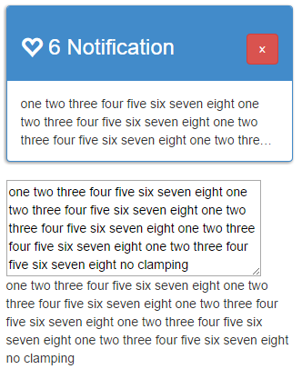
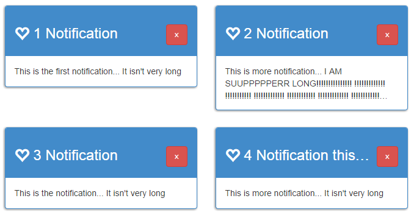

> This post is outdated and only exists for historical reasons

After spending an annoyingly long time (more that I would have liked to)
I found a rather neat way to incorporate line clamping into my project!

My first need for line clamping was a 1 line header in my web page.
It didn't look too dandy once the text flowed over it :(

This was solved rather easily with some simple CSS:

```css
span.panelTitle {
  display: inline-block; /* so height and width actually take affect */
  max-width: 50%;
  overflow: hidden;
  -moz-text-overflow: ellipsis;
  text-overflow: ellipsis;
  white-space: nowrap; /* important to show ellipsis, or words will just be broken off */
}
h3 span {
  height: 1em; /* so overflow hidden works and keeps text on one row */
}
```

(thanks to http://www.answerques.com/s1NigUgSgePU/dynamic-maximum-width-for-text)

which worked amazingly... but only for one line...

It seams that text-overflow doesn't really work too well for multiple line situations.

After doing a fair amount of research into how to get a multiple line solution working I found [clamp.js](https://github.com/josephschmitt/Clamp.js/).
It worked great! the only problem is that I was dynamically creating new notification with Knockout and these
new notifications needed clamping!

I tried to subscribe to the event change but unfortunately that didn't work too well because the
innards of the html hadn't been rendered when the subscription fired,
plus I would be re-clamping on every item (1000+ clamps every time a notification came in could be problematic!).

My next attempt was to attach myself to the afteradd binding of foreach.
That didn't work too well either as the root element of the notification was created at that point,
but I was clamping a child node (which hadn't been populated yet).

Being new to Knockout I had never made my own binding, which is why it didn't cross my mind.
But when I tried and failed to use the foreach binding's afteradd I realised. Why not make my own binding?

I then found that it was trivial to do this.
I simply created a new js file: binding-clamp.js and made the following 6 lines of code:

```js
ko.bindingHandlers.ellipseOutput = {
  update: function (element, valueAccessor) {
    // access ellipseOutput's value, this will contain the desired line count
    var linesToDisplay = ko.unwrap(valueAccessor()); // edit: thanks Patrick Steele for update
    $clamp(element, { clamp: linesToDisplay });
  }
};
```

and put my custom data binding inside of my notification panel

```html
<div class="container" style="margin-top: 10px;" data-bind="foreach: notifications">
  <div class=" col-lg-4 col-md-6 col-sm-6 col-xs-12 notification">
    <div class="panel panel-primary shadowBorder">
      <div class="panel-heading">
        <h3><span class="glyphicon glyphicon-heart-empty"></span> <span class="panelTitle" data-bind="text: title"></span>
          <button class="btn btn-danger pull-right" data-bind="click: $parent.removeNotification">&times;</button>
        </h3>
      </div>
      <div class="panel-body">
        <span data-bind="text: content, ellipseOutput: 3"></span>
      </div>
    </div>
    <textarea cols="55" rows="5" data-bind="value: content"></textarea>
    <div data-bind="text: content"></div>
  </div>
</div>
```

now when ever I add or remove notifications the text is automatically clamped!!!

After creating this I wondered if anybody else had ever came across this issue and made a solution,
I found the following [implementation](https://gist.github.com/nathggns/0874a3558d1f107e3922) during my research.
This solution looks allot more thought through
and backwards compatible (I am using Knockout 3.2) but allot of the code is to do with saving the
text as clamp.js is destructive.

I then frowned thinking, great, my data in my View Model will now contain "..." whenever it's too long.

But when I created a textarea who's value was bound to my viewmodel's data + a div repeating the data out without clamping I found that the data in the VM hadn't been messed with.



This must have something to do with the fact that the data-bind that I had was a text binding,
maybe knockout only applies one way binding to a text field.

The result ended up looking perfect. the top right notification had it's content clamped (via clamp.js)
and the header on the bottom right notification has a clamped title (via css)



I hope this blog proves to be useful for any other people out there learning Knockout.js.
I plan to make more blog posts and more regularly so feel free to subscript to my rrs through the button up top or [here](/feeds/posts/default)!

Thanks for reading.