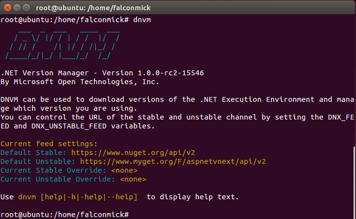
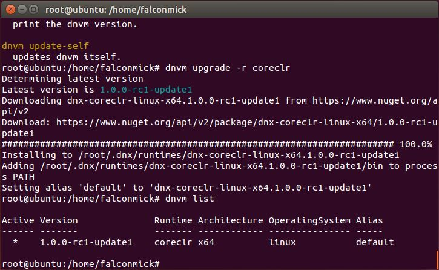
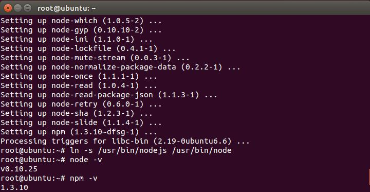
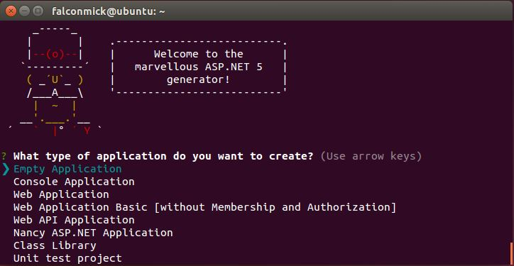
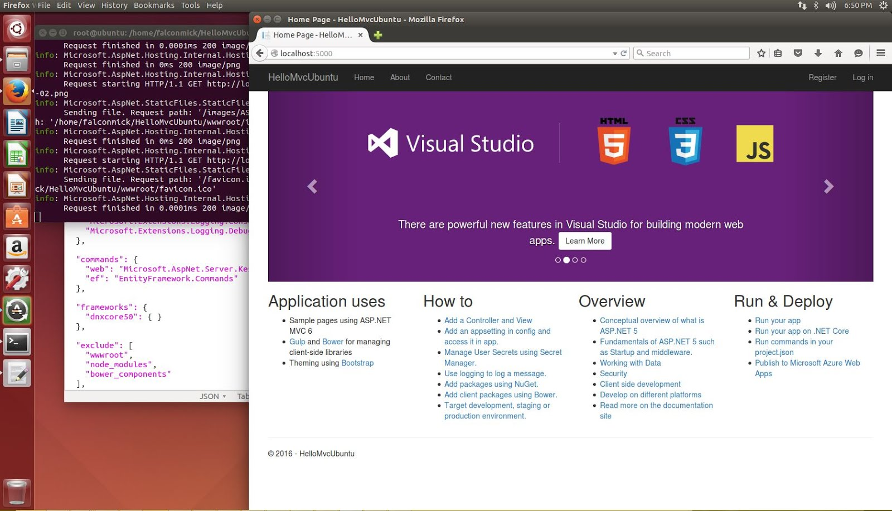

> This post is outdated and only exists for historical reasons

I thought I would make my first blog post in a while on something I have been learning recently,
that is .Net Core, more specifically on Ubuntu 14.


First things first, open a terminal! Personally I run all these commands under the root user,
so I will be using 'sudo su' so that I don't have to enter sudo every time I need
super user privileges (so if you don't you will need sudo in front of almost all of the commands).
I have also found that sometimes the permisions between the root user and the
local user can cause issues if you don't install everything against ONE user.
If you use 'sudo su' you will have to use the root account for everything
you install through apt-get, but you will still have to run the packages you
install via npm under your account as root won't have access (this is important for Yeoman)

### Installing .Net Core
The following will walk you through the preperation of your system

### Installing DNVM
The next step is to enter some commands that will allow us to download and install DNVM.
DNVM stands for Dot Net Version Manager and is the tool used to set and manage the
.net run-times on your machine. For more information check out the aspnet documentation
on DNVM (link removed as dotnet team has removed this documentation).

```bash
sudo su
apt-get install unzip curl
curl -sSL https://raw.githubusercontent.com/aspnet/Home/dev/dnvminstall.sh | DNX_BRANCH=dev sh && source ~/.dnx/dnvm/dnvm.sh
```

After doing the above commands you can test that the installation worked by typing 'dnvm'



If you do not see the above once you have entered the above commands
then look for error messages and or try to enter the
command "`source ~/.dnx/dnvm/dnvm.sh`". This should run automatically though.
If you would like to find out more about the dnvm you can also type "`dnvm -h`" to bring up the help.

### Installing DNX and Core CLR
The following commands will download the prerequisites of the dnx and then install the Core CLR.
The core CLR is the new open source implementation of .net which has been built
from the ground up to be used to build .net apps cross platform and has been cloud optimised.
It is light weight and highly uncoupled. Unlike .net 4 and mono,
it is installed per app rather than per system, this per app design is great
as it will allow devs in the future to install new apps to their servers
without having to upgrade all their old apps and without the system admins input!

```bash
apt-get install libunwind8 gettext libssl-dev libcurl4-openssl-dev zlib1g libicu-dev uuid-dev
dnvm upgrade -r coreclr
```

The first line installs the prerequisites and the second instructs the dnvm to
either install the latest coreclr or to update to the latest,
you MUST include "`-r coreclr`" as it instructs the dnvm you don't want to
upgrade the default mono clr. It is at ths time that you could also install mono,
but I have chosen not too as this blog post is about the core clr.

To verify that you have the core clr installed and to check what runtime is active, type "`dnvm list`"



Two things to note:
1. Active: shows you which run time is currently in use.
2. Alias: When you upgrade the default alias is automatically added, if you have multiple run times you can utilize the 'dnvm use' command with '-p' to switch the active run time and to remove the current default alias and set it to the newly selected one.

### Installing Kestrel requirements
When we eventually create a MVC 6 website, we will need somthing to run it!
So I have opted to use the default web server that .net core is provided, Kestral.


To run Kestral, we will need to install libuv, a multi-platform asynchronous IO library!

```bash
apt-get install make automake libtool curl
curl -sSL https://github.com/libuv/libuv/archive/v1.8.0.tar.gz | sudo tar zxfv - -C /usr/local/src
cd /usr/local/src/libuv-1.8.0
sh autogen.sh
./configure
make
make install
rm -rf /usr/local/src/libuv-1.8.0 && cd ~/
ldconfig
```

The above installs libtool and curl, then downloads the libuv source, configures it,
compiles it and finally installs it. ldconfig is used to update the ld.so.cache so that
dlopen can load it.

Congratulations! You now have a working .net environment on your system!
What's next? Actually making something!

### MVC 6 with YeoMan scaffolding!
To use YeoMan to scaffold the default project that we have all grown to love from Visual Studio,
we first will need to install a few things, namely node, npm, yo and generator-aspnet!

### Installing Node.js and NPM
installing node is simple enough, there are just a few apt-get to run and your good!

```bash
apt-get install nodejs
apt-get install npm
ln -s /usr/bin/nodejs /usr/bin/node
```

What it does is fairly self explanitory, install the nodejs and npm, then add a
symbolic link for node so we can use node in the terminal.
From here we can enter 'node -v' and 'npm -v' to confirm installation.



### Updating NodeJs
The next is optional, but if your system already has nodejs installed
making sure you have the latest version of nodejs is a good idea!

```bash
npm cache clean -f
npm install -g n
n stable
```

This will clean out the npm cache and the next line installs the n package (node helper) globally (-g).
From there we run n stable to tell the node helper to update to the latest stable release.
You could also enter a specific version you want to use instead of stable.
Next when you type you will find your node is up to date!

### Installing YeoMan and the aspnet generators
Almost on the home stretch now! All that is left is to install YeoMan and the aspnet generators

```bash
npm install -g yo
npm install -g generator-aspnet
```

This will install YeoMan and the aspnet YeoMan Generators globally.

### Scaffolding the MVC Starter Template
All that is left now is to actually run the YeoMan aspnet gernerator!
Today we will be creating the default MVC Web Template that you make when you choose the
default authentication in Visual Studio.

First type 'yo aspnet' into the console. You will be presented with an error! Oh no!
Don't worry, if you see this there is a good chance it is because you are still under the
root account and you just need to type 'exit' to go back to your users session.
I don't know why 'yo' won't work for me under the root account, but the fix is easy enough.
Try again and this time you will be presented with the following (after choosing to contribute your data or not):



From here you can use your arrow keys to navigate the menu, choose Web Application.
Then choose a nice name (I will be using 'HelloMvcUbuntu').

All that is left to do is follow the instructions it leaves you. If you ran the installation under the
root (sudo su) account you will need to login to the super user account again (type "`sudo su`")

```bash
cd "HelloMvcUbuntu"
dnu restore
dnu build # optional, build will also happen when it's run
dnx web
```

this will move you into the newly created directory and restore all of the nuget packages
that are required as documented inside of project.json. If you want to have a look around the
directory either use 'ls' and 'cd' OR you can use 'xdg-open .' to open the current
directory in the Ubuntu file explorer.

If you want to be able to run 'dnu build' you will need to make a modification to project.json.
Inside of the frameworks you will see there is 'dnx451' which is actually only available on windows,
so you can either remove it or add mono in there if you have it installed.

After running all of those commands congrats! your website running in aspnet is now running on http://localhost:5000.



Just as a heads up, in the next release candidate (rc2) and all the future versions the two commands dnu and dnx are
merging into the single tool command 'dotnet' so instead of the above commands you would use:

```bash
cd "HelloMvcUbuntu"
dotnet restore
dotnet build # optional, build will also happen when it's run
dotnet web
```

I hope this helps somebody out there,
if you have any questions or feedback please feel free to leave them in the comments bellow.

References:
- [Installing ASP.NET 5 On Linux](https://docs.asp.net/en/latest/getting-started/installing-on-linux.html)
- [Install Node.js with Ubuntu Package Manager](http://www.hostingadvice.com/how-to/install-nodejs-ubuntu-14-04/#ubuntu-package-manager)
- [Upgrade Node.js via NPM](https://davidwalsh.name/upgrade-nodejs)
- [Aspnet YeoMan Generator Github](https://github.com/omnisharp/generator-aspnet#readme)