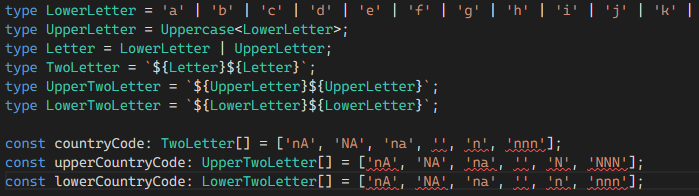

---
title: How to create a type that constrains characters
date: 2022-02-07
excerpt: Using Template Literal Types to solve the typing challenge raised on Syntax episode 432
image: ./syntax-ts.png
tags: ["typescript", "syntax", "podcast", "type", "challenge", 'uses.tech']
---

During [episode 432](https://syntax.fm/show/432/potluck-selling-themes-which-browser-should-devs-use-where-do-you-keep-2fa-codes-remix-vs-svelte-kit-getting-unstuck-from-tutorial-hell)
of the syntax podcast (23m 45s) Wes raised a problem that [uses.tech](https://uses.tech/) was facing in which he wants the typing system to restrict what
a contributor is able to type as their country code. The brute force solution being enter in literally every country code there
is inside of a union type ([see docs](https://www.typescriptlang.org/docs/handbook/2/everyday-types.html#union-types))
however this list is going to get very long and a pain to manage.

Other solutions raised by Wes included using regex or other javascript based code to check the code either manually OR during
build time, however that doesn't really work nice because when you are authoring code you shouldn't have to execute custom
tooling to validate that the shape of the type you are entering is working correctly nor should you need to handle re-tooling
when you need to say validate with a similar rule in another place of your codebase.

Along comes Typescript 4.1 and [Template Literal Types](https://www.typescriptlang.org/docs/handbook/2/template-literal-types.html) to the rescue!
This wonderful new syntax (mind the pun) for defining types allows us to leverage typescript's language service
to generate a massive union set (or small) for each possible incantation of a string [Literal Type](https://www.typescriptlang.org/docs/handbook/2/everyday-types.html#literal-types)

For example check out from the docs this example:

```ts
type EmailLocaleIDs = "welcome_email" | "email_heading";
type FooterLocaleIDs = "footer_title" | "footer_sendoff";

type AllLocaleIDs = `${EmailLocaleIDs | FooterLocaleIDs}_id`;
// type AllLocaleIDs = "welcome_email_id" | "email_heading_id" | "footer_title_id" | "footer_sendoff_id"
```

So how do we use this cool new magic that Template Literal Types provides? First we just write out each letter and throw in a dash of Utility types!

```ts
type LowerLetter = 'a' | 'b' | 'c' | 'd' | 'e' | 'f' | 'g' | 'h' | 'i' | 'j' | 'k' | 'l' | 'm' | 'n' | 'o' | 'p' | 'q' | 'r' | 's' | 't' | 'u' | 'v' | 'w' | 'x' | 'y' | 'z';
type UpperLetter = Uppercase<LowerLetter>;
type Letter = LowerLetter | UpperLetter;
```

What we have done here is is defined a union of string literals that covers every letter of the alphabet! From there we
can utilise the [Uppercase Utility Type](https://www.typescriptlang.org/docs/handbook/utility-types.html#intrinsic-string-manipulation-types)
which just so happens to also work wonders for unions to make the exact same alphabet but capitalised.

Now up next we need to define our type that gives us our solution! Which is where the Template Literal Types come in! As you can see
bellow it is also possible to control if the user can use upper or lower or both.

```ts
type TwoLetter = `${Letter}${Letter}`; // 'nA', 'NA', 'na'
type UpperTwoLetter = `${UpperLetter}${UpperLetter}`; // 'NA'
type LowerTwoLetter = `${LowerLetter}${LowerLetter}`; // 'na'
```

For a full editable demo head on over to the [TS Playground](https://www.typescriptlang.org/play?#code/C4TwDgpgBAMg9gdwgJxhYwVQLxQOQCGeUAPvgEbFl4DGV+AJvXhMwGbMDmzAFswJbMAVswDWzADbMAtswB2zOMzDMAjs2TMAzs2DMArswBuzBMwAezEMwBeeANwBYAFChIUAKphIqdJmQ4nt4oNARaEAA88Ei+GCgAfE6u4NBocQG40Shp-qRBPjkoSW7QACoIcIUZUAAGACQA3lUAvo0tNcUp+SjllX5YuPUNXgX9yK3DwbH+zR0uJbCIPRVVgUNZ0ygTG+1JLjRwclrAUAf6csDIIADCcAwQAFxQvVUA2gC6ga94cgCCeAAafAAOX+QJ+RHBgPwCnBcnheHeSQORxO+imt3Olxud0e3WQLzGHy+PzBILJEOheCpwJpwNpSP2h2OUAkS2QmIuV1u9yeG0J6WJuG+fxpFLkkPwVNhMIRSKAA)

or here's a screenshot showing the typing working as you type so that you know that your PR to [uses.tech](https://uses.tech/) will fail!



Hope this helps anyone wanting to learn more about Typescript typing. Coming up soon an opinion piece on why you should
never (almost never) use null or undefined to signal an outlier/error/edge case in your Typescript functions but instead
utilise Unions and string literals as a more verbose and extendable solution that will improve your code 10x!