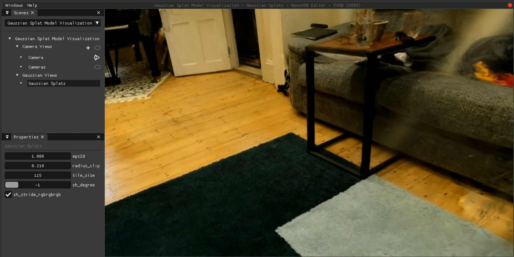

---
title: Setting up Ubuntu 22.04 to run fVDB Reality Capture
date: 2026-04-09
excerpt: Got a macOS and want to do Gaussian splatting? Hosted GPU as a service is the best way!
image: ./house-splat.png
socialImage: ./house-splat.png
tags: ["ubuntu", "gaussian-splat"]
---

```
This post is a work in progress, please exuse the mess
```

I found myself wanting to dabble in Gaussian splats but at the same time not wanting to have to buy a GPU (with prices how they are!)
so instead of following the typical flow for Gaussian splatters' and starting on a gaming GPU and working my way up to hosted
GPU I have decided to jump directly to hosted GPUs!

For this process I have gone with [paperspace](https://www.paperspace.com) however any GPU as a service host should work
all we need is ssh access, you will find that you can only really gain access to Gaming computer as a service providers without
approval from the IaaS providers like paperspace/aws/azure but I have found their offerings to be a bit too expensive for
what you get + typically they are windows boxes (so that won't work for fVDB). Just open a support ticket and get your
access, you will have to wait a day but that's just a part of the cost of getting good access.

## setting up the box

as soon as you boot up the box the first thing is to start updating the box and installing software:

```bash
sudo apt update
```

Now we will need to install the nvidia GPU drivers, to do so we will run `sudo ubuntu-drivers devices` and find
the row which has `recommended` on it, it will look something like so:

```bash
driver   : nvidia-driver-580 - distro non-free recommended
driver   : nvidia-driver-535 - distro non-free
driver   : nvidia-driver-570-server-open - distro non-free
driver   : nvidia-driver-570-open - distro non-free
```

in the above example we want `nvidia-driver-580`, so we will install the drivers like so:

```bash
sudo apt install -y nvidia-driver-580
sudo reboot
```

after this completes you want to restart the machine which is why I have included the reboot command.
Don't forget that you need to place the `recommended` driver after the `-y` and not what my example showed.

From there we will see what cuda is supported by these drivers with the following command:

```bash
nvidia-smi
Wed Apr  8 16:59:16 2026
+-----------------------------------------------------------------------------------------+
| NVIDIA-SMI 580.126.09             Driver Version: 580.126.09     CUDA Version: 13.0     |
+-----------------------------------------+------------------------+----------------------+
| GPU  Name                 Persistence-M | Bus-Id          Disp.A | Volatile Uncorr. ECC |
| Fan  Temp   Perf          Pwr:Usage/Cap |           Memory-Usage | GPU-Util  Compute M. |
|                                         |                        |               MIG M. |
|=========================================+========================+======================|
|   0  NVIDIA RTX A4000               Off |   00000000:00:05.0 Off |                  Off |
| 61%   80C    P2            137W /  140W |    2857MiB /  16376MiB |     90%      Default |
|                                         |                        |                  N/A |
+-----------------------------------------+------------------------+----------------------+

+-----------------------------------------------------------------------------------------+
| Processes:                                                                              |
|  GPU   GI   CI              PID   Type   Process name                        GPU Memory |
|        ID   ID                                                               Usage      |
|=========================================================================================|
|    0   N/A  N/A            1546      C   ...space/fvdb-env/bin/python3.10       2850MiB |
+-----------------------------------------------------------------------------------------+
```

From this we can see this box now supports CUDA 13.0, keep this in mind.

Now that we have the GPU drivers setup we will need to install all the python and fVDB dependencies, to simplify this
I have created a setup script that automates the process and makes customisation a bit easier:

```bash
#!/usr/bin/env bash
set -euo pipefail

PYTHON_VERSION=3.10
VENV_NAME=fvdb-env

TORCH_VERSION=2.10.0
TORCH_CUDA=cu130
FVDB_CORE_VERSION="0.4.2+pt210.${TORCH_CUDA}"

echo "[0/5] Checking GPU..."
command -v nvidia-smi >/dev/null || { echo "nvidia-smi not found"; exit 1; }
nvidia-smi >/dev/null || { echo "GPU not working"; exit 1; }

echo "[1/5] System deps..."
sudo apt update
sudo apt install -y \
  python${PYTHON_VERSION} \
  python${PYTHON_VERSION}-venv \
  python3-pip \
  build-essential \
  git \
  ninja-build \
  cmake \
  libgl1 \
  libglib2.0-0

echo "[2/5] Python env..."
python${PYTHON_VERSION} -m venv $VENV_NAME
source $VENV_NAME/bin/activate
pip install --upgrade pip setuptools wheel

echo "[3/5] PyTorch..."
pip install \
  torch==${TORCH_VERSION} \
  --index-url https://download.pytorch.org/whl/${TORCH_CUDA}

python - <<EOF
import torch
assert torch.cuda.is_available(), "CUDA not available"
print("Torch:", torch.__version__)
print("GPU:", torch.cuda.get_device_name(0))
EOF

echo "[4/5] fVDB..."
pip install \
  fvdb-core==${FVDB_CORE_VERSION} \
  fvdb-reality-capture \
  --extra-index-url https://d36m13axqqhiit.cloudfront.net/simple

echo "[5/5] Verify..."
python - <<EOF
import torch, fvdb
assert torch.cuda.is_available()
x = torch.randn(1, device="cuda")
print("OK:", x)
EOF

export PATH=$PATH:$(pwd)/fvdb-env/bin
echo "DONE → source $VENV_NAME/bin/activate"
```

By default, this script has CUDA 12.8 selected as to make this applicable to as many people as possible, however if
your GPU supports CUDA 13 you can swap `TORCH_CUDA=cu128` to be `TORCH_CUDA=cu128`.

You should also update your `~/.bashrc` to include `export PATH=$PATH:$(pwd)/fvdb-env/bin` at the end of it so that
on a new bash shell instance you have access to the `frgs` cli tool.

Given this blog post will be out of date the second a new version of fVDB is released i will also recommend that you check
out https://openvdb.github.io/fvdb-core/installation.html and look at the Software requirements and adjust the torch and
python versions as required.

## Getting started with splatting over SSH
From this point onwards you can follow the tutorial over at https://openvdb.github.io/fvdb-core/reality-capture/tutorials/frgs.html
one little trick I can give is when you start using the commands like `frgs show` a web server will be hosted on port
8080 (or on any port you choose if you provide a `-p 8888` argument). To view this site on your local machine
you can open up a second SSH session which is mapping over that port via: `ssh -L 8080:127.0.0.1:8080 username@host`
where `username@host` is what you are using to connect to your ssh box. now you will be able to follow along fully
with the tutorial!

